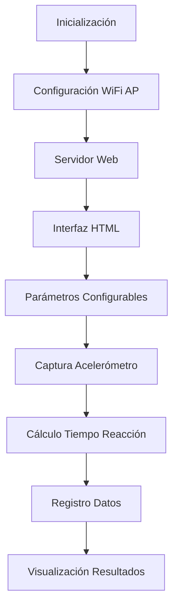

# Tiempo de Reacción (T.R.) - Medición del TR en Salidas de Tacos

[](LICENSE.txt)
[](https://github.com/fran-byte/tiempo_reaccion)
[](https://github.com/fran-byte/tiempo_reaccion)

<p align="center">
  
</p>

## Tabla de Contenidos
- [Descripción del Proyecto](#descripción-del-proyecto)
- [Características Técnicas](#características-técnicas)
- [Configuración del Hardware](#configuración-del-hardware)
  - [Requisitos](#requisitos)
  - [Instalación del Entorno](#instalación-del-entorno)
  - [Diagrama de Conexiones](#diagrama-de-conexiones)
- [Arquitectura del Software](#arquitectura-del-software)
- [Protocolos de Comunicación](#protocolos-de-comunicación)
- [Especificaciones de los Componentes](#especificaciones-de-los-componentes)
  - [NodeMCU ESP8266](#nodemcu-esp8266)
  - [Acelerómetro ADXL345](#acelerómetro-adxl345)
- [Implementación](#implementación)
- [Calibración y Uso](#calibración-y-uso)
- [Referencias](#referencias)
- [Licencia](#licencia)
- [Estado del Proyecto](#estado-del-proyecto)

## Descripción del Proyecto
Sistema embebido para medición precisa de tiempos de reacción en salidas de tacos de atletismo, compuesto por:

- **Nodo sensor**: NodeMCU ESP8266 + acelerómetro ADXL345
- **Interfaz web**: Servidor HTTP integrado para configuración y visualización
- **Mecanismo de disparo**: Buzzer piezoeléctrico con aislamiento óptico

<p align="center">
  
</p>

## Características Técnicas
| Parámetro | Especificación |
|-----------|----------------|
| Precisión temporal | ±1ms |
| Rango de medición | 50-1000ms |
| Sensibilidad configurable | 3 niveles |
| Protocolo de comunicación | I2C (400kHz) |
| Interfaz de usuario | Web responsive (192.168.4.1) |
| Alimentación | Batería Li-ion 8.4V (4.5-9V DC) |
| Consumo | 150mA en operación |

## Configuración del Hardware

### Requisitos
- IDE Arduino 1.8.19+
- Driver CP2102 (para comunicación serial)
- Biblioteca Adafruit_ADXL345_U (v1.2.0)
- Biblioteca ESP8266WiFi (v2.7.4)

### Instalación del Entorno
1. Agregar URL de boards ESP8266:
   ```http
   http://arduino.esp8266.com/stable/package_esp8266com_index.json
   ```
2. Instalar plataforma ESP8266 via Boards Manager
3. Instalar bibliotecas requeridas via Library Manager

### Diagrama de Conexiones
<p align="center">
  
</p>

| NodeMCU | ADXL345 | Otros |
|---------|---------|-------|
| 3.3V    | VCC     |       |
| GND     | GND     |       |
| D1 (GPIO5) | SDA   |       |
| D2 (GPIO4) | SCL   |       |
|         | CS      | 3.3V  |
| D3 (GPIO0) |       | Optoacoplador PC817 |
| Vin      |       | Batería 8.4V |

## Arquitectura del Software


## Protocolos de Comunicación

### I2C Configuration
```cpp
#include <Wire.h>
#define ADXL345_ADDRESS 0x53

void setup() {
  Wire.begin(D1, D2); // SDA, SCL
  Wire.beginTransmission(ADXL345_ADDRESS);
  Wire.write(0x2D); // Power register
  Wire.write(8);    // Measurement mode
  Wire.endTransmission();
}
```

### Web Server Endpoints
| Endpoint | Método | Descripción |
|----------|--------|-------------|
| /        | GET    | Interfaz principal |
| /start   | POST   | Inicia medición |
| /config  | POST   | Ajusta sensibilidad |
| /data    | GET    | JSON con resultados |

## Especificaciones de los Componentes

### NodeMCU ESP8266
<p align="center">
  
</p>

**Características clave:**
- SoC: ESP8266EX
- CPU: Tensilica L106 32-bit RISC (80/160MHz)
- Memoria: 32KB instrucción + 80KB user data
- Flash: 4MB (SPI)
- WiFi: 802.11 b/g/n (2.4GHz)
- Interfaces: GPIO, I2C, SPI, UART, ADC
- Tensión operación: 3.3V DC

### Acelerómetro ADXL345
<p align="center">
  
</p>

**Parámetros técnicos:**
- Rango configurable: ±2g/±4g/±8g/±16g
- Resolución: 13-bit (4mg/LSB a ±2g)
- Interfaz: I2C/SPI digital
- Consumo: 40-140μA
- Banda ancha: 0.5-1600Hz

## Implementación

### Lógica de Medición
```cpp
void measureReaction() {
  unsigned long startTime = micros();
  sensors_event_t event;
  accelerometer.getEvent(&event);
  
  while(abs(event.acceleration.x) < threshold) {
    accelerometer.getEvent(&event);
    if(micros() - startTime > 1000000) break; // Timeout 1s
  }
  
  reactionTime = (micros() - startTime) / 1000.0;
  if(reactionTime < 100) reactionTime = 0; // False start
}
```

### Optimizaciones
- Muestreo a 400Hz (periodo 2.5ms)
- Filtro digital pasa-bajos (α=0.3)
- Aislamiento mecánico del buzzer
- Calibración in-situ mediante offset

## Calibración y Uso
1. Conectar a red WiFi "Club-Atletismo-Leganes"
2. Acceder a http://192.168.4.1
3. Realizar prueba de calibración
4. Ajustar offset según referencia
5. Iniciar secuencia de medición

<p align="center">
  
</p>

**Nota:** Tiempos <100ms se consideran salida nula.

## Referencias
1. [Datasheet ESP8266EX](https://www.espressif.com/sites/default/files/documentation/0a-esp8266ex_datasheet_en.pdf)
2. [ADXL345 Technical Reference](https://www.analog.com/media/en/technical-documentation/data-sheets/adxl345.pdf)
3. [I2C Protocol Specification](https://www.nxp.com/docs/en/user-guide/UM10204.pdf)

## Licencia
Este proyecto está licenciado bajo [MIT License](LICENSE.txt).

## Estado del Proyecto
**Beta activa** - Actualmente en fase de pruebas de campo

<p align="center">
  
</p>
